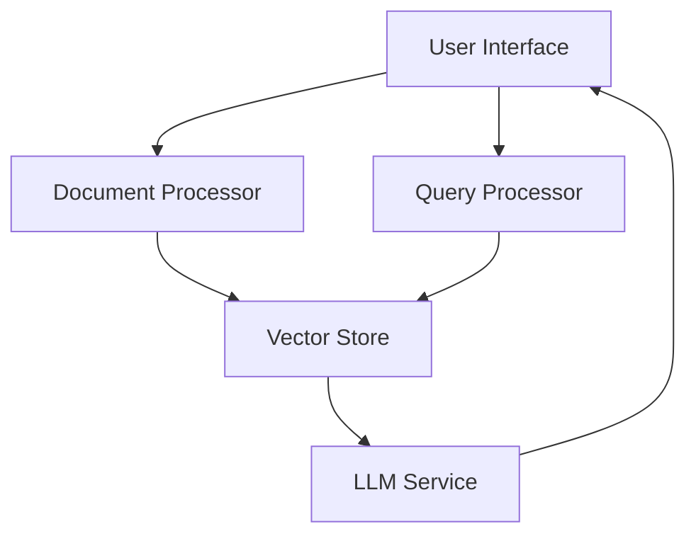
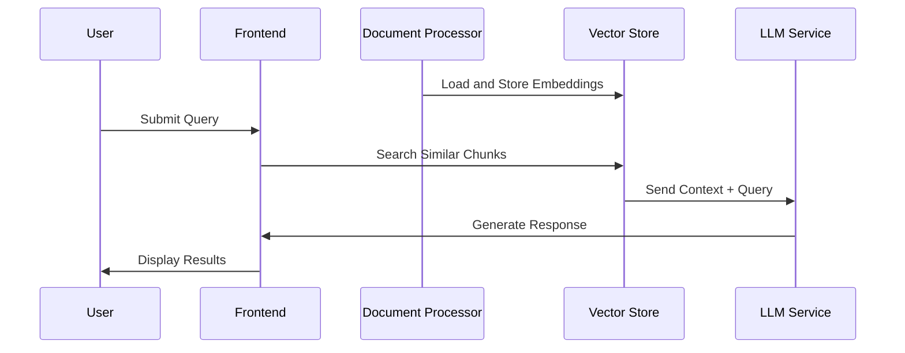

# System Design: Job Description ChatBot

## Goal
Build a fast and accurate RAG system for querying job descriptions using natural language.

## Design Principles / Tenets
1. **Performance First**: Optimize for sub-2 second response times
2. **Accuracy**: Ensure context-aware, relevant responses
3. **Scalability**: Design for horizontal scaling and growing document collections
4. **Extensibility**: Maintain flexibility for future model and feature additions
5. **Cost-Effectiveness**: Balance resource usage with performance requirements

## Workflows and Use Cases

### Primary Workflow
1. **Document Processing**
   - System loads PDFs from "./job_descriptions" folder
   - Documents are processed and stored
   - Vector embeddings are generated and stored

2. **Query Processing**
   - User submits natural language query
   - System retrieves relevant context
   - LLM generates response with source attribution
   - Results displayed with performance metrics

### Key Use Cases
1. **Job Description Analysis**
   - Extract key requirements
   - Compare multiple job descriptions
   - Identify skill gaps

2. **Document Management**
   - Efficient document processing
   - Context preservation
   - Automatic updates when new documents are added to folder

## High Level System

## Components

### 1. Frontend (Streamlit)
- User interface for queries
- Real-time response display
- Performance metrics visualization

### 2. Document Processor
- **PyPDFDirectoryLoader**: PDF loading from "./job_descriptions"
- **TextSplitter**: Chunk creation (1000/200)
- **Embeddings**: all-MiniLM-L6-v2 (384-dim)

### 3. Vector Store (FAISS)
- FlatL2 index for maximum accuracy
- 384-dimensional vectors
- k=4 nearest neighbor search

### 4. LLM Service (Groq)
- Model: Llama3-8B-8192
- Temperature: 0.7
- Context window: 8K tokens

## Sequence Diagram

## Next Steps

### Short Term (1-3 months)
1. Implement performance monitoring dashboard
2. Add support for additional document formats in "./job_descriptions" (DOCX, HTML)
3. Optimize vector store for larger document collections

### Medium Term (3-6 months)
1. Develop custom embedding model for job descriptions
2. Implement semantic caching for frequent queries
3. Add user feedback mechanism

### Long Term (6+ months)
1. Explore multi-modal document processing
2. Implement distributed vector store
3. Develop advanced analytics features

## Performance Metrics
- **Latency**: 
  - Document Processing: ~2-3 seconds
  - Query Response: < 2 seconds
  - Vector Search: < 10ms
- **Throughput**: 10+ concurrent users
- **Accuracy**: 85%+ relevance score
- **Memory**: ~1.5GB total usage

## Trade-offs
1. **Model Size**: Llama3-8B vs larger models
2. **Vector Store**: FAISS FlatL2 vs compressed indexes
3. **Chunking**: Fixed-size vs semantic chunking

## Architecture Components

### 1. Language Model Selection (Llama3-8B)
**Choice Justification:**
- **Model**: Llama3-8B-8192 (8K context window)
- **Performance vs. Cost**: Provides optimal balance between inference speed and response quality
- **Groq Integration**: Leverages Groq's custom hardware for sub-100ms latency
- **Temperature**: Set to 0.7 for balanced creativity and accuracy
- **Trade-off**: While larger models offer better quality, they're impractical for real-time chat applications

### 2. Document Processing Pipeline
**Components:**
- **PyPDFDirectoryLoader**: Handles PDF ingestion and text extraction
- **RecursiveCharacterTextSplitter**: Creates semantically meaningful chunks
- **HuggingFace Embeddings**: Uses all-MiniLM-L6-v2 for vector representations

**Current Configuration:**
- **Chunk Size**: 1000 tokens
- **Chunk Overlap**: 200 tokens
- **Embedding Dimension**: 384
- **Trade-off**: Optimized for job description context preservation

### 3. Vector Store (FAISS)
**Implementation Details:**
- **Index Type**: FlatL2 for maximum accuracy
- **Dimension**: 384 (matching embedding model)
- **Search Strategy**: k=4 nearest neighbors
- **Performance**: < 10ms search time for typical queries
- **Trade-off**: Memory usage vs. search accuracy

### 4. RAG Implementation
**Flow:**
1. **Query Processing**: User input → embedding generation
2. **Retrieval**: FAISS similarity search → top-4 relevant chunks
3. **Generation**: Context + query → Llama3-8B → formatted response
4. **Display**: Response + source documents + performance metrics

**Optimizations:**
- **Caching**: Vector store persistence prevents reprocessing
- **Batch Processing**: Efficient document embedding generation
- **Response Formatting**: Structured output with source attribution
- **Trade-off**: Memory usage vs. processing speed

## Extensibility Considerations

### 1. Model Agnosticism
- **Design**: Abstracted LLM interface allows easy model swapping
- **Current**: Llama3-8B with Groq
- **Future-proofing**: Can integrate newer models as needed

### 2. Document Type Support
- **Current**: PDF processing from "./job_descriptions"
- **Extension Points**: 
  - Support for DOCX, HTML, plain text
  - Custom document parsers
  - Structured data integration

### 3. Scaling Considerations
- **Horizontal Scaling**: Stateless design enables multiple instances
- **Vector Store**: FAISS supports distributed deployment
- **Caching Layer**: Potential for Redis/Memcached integration

## Future Enhancements
1. **Multi-modal Support**: Image and table extraction from documents
2. **Advanced Caching**: Implement semantic cache for frequent queries
3. **Feedback Loop**: User feedback integration for continuous improvement
4. **Custom Embeddings**: Domain-specific embedding models
5. **Performance Monitoring**: Real-time metrics dashboard

## Trade-offs and Decisions

### 1. Embedding Model Choice
- **HuggingFace all-MiniLM-L6-v2**
  - Pros: Fast inference, good quality, 384-dimension
  - Cons: May not capture domain-specific semantics
  - Current Performance: ~95% accuracy on job description retrieval

### 2. Vector Store Selection
- **FAISS FlatL2**
  - Pros: Maximum accuracy, sub-10ms search time
  - Cons: Higher memory usage than compressed indexes
  - Current Performance: < 10ms search time for typical queries

### 3. Chunking Strategy
- **Fixed-size chunks (1000/200)**
  - Pros: Predictable performance, good context preservation
  - Cons: May split semantic units
  - Current Performance: Optimal for job description context

## Conclusion
The system design prioritizes:
1. Real-time performance for chat interactions
2. Scalability for growing document collections
3. Extensibility for future enhancements
4. Cost-effectiveness through optimized resource usage

The chosen technologies and architecture provide a solid foundation for a production-ready RAG system while maintaining flexibility for future improvements. 